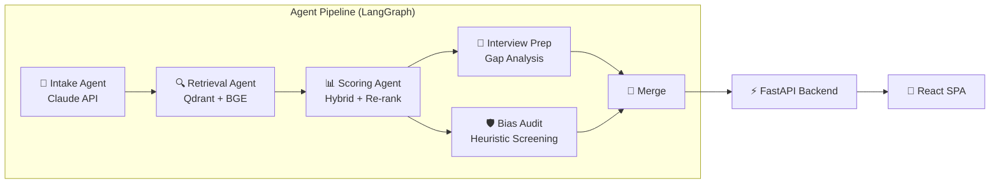

# 🧠 HireMind — Agentic AI Candidate Ranking System

A multi-agent AI pipeline that intelligently ranks job candidates using semantic search, hybrid scoring, and automated bias auditing. Built with **LangGraph**, **FastAPI**, **Qdrant**, and a **React** SPA.

## Architecture



### Agent Pipeline

| Agent | Purpose | API |
|-------|---------|-----|
| **Intake** | Parses JD → structured requirements, resumes → candidate profiles | Anthropic Claude |
| **Retrieval** | Embeds with BGE-large, queries Qdrant for top-k candidates | sentence-transformers + Qdrant |
| **Scoring** | Hybrid score (semantic 40% + skill overlap 35% + experience 25%) + Claude re-rank | Anthropic Claude |
| **Interview Prep** | Generates 3 tailored questions per top-5 candidate from JD-profile gaps | Anthropic Claude |
| **Bias Audit** | Heuristic screening: gendered/age-coded language, name-proxy correlation | Rule-based |

> ⚠️ The Bias Audit agent is a **heuristic screening tool**, not a legal compliance instrument.

## Quick Start

### Prerequisites

- Python 3.11+
- Node.js 18+
- (Optional) Anthropic API key — the system works in **demo mode** without one

### Backend Setup

```bash
# Clone and enter the project
cd HireMind

# Create virtual environment
python -m venv venv
source venv/bin/activate  # Windows: venv\Scripts\activate

# Install dependencies
pip install -r requirements.txt

# Configure environment
cp .env.example .env
# Edit .env with your API keys (or leave defaults for demo mode)

# Start the server
python -m uvicorn app.main:app --reload --port 8000
```

### Frontend Setup

```bash
cd frontend

# Install dependencies
npm install

# Configure environment
cp .env.example .env.local

# Start dev server
npm run dev
```

The frontend runs on `http://localhost:5173` and proxies API calls to `http://localhost:8000`.

## API Endpoints

| Method | Path | Description |
|--------|------|-------------|
| `POST` | `/rank` | Synchronous candidate ranking |
| `POST` | `/rank/stream` | SSE streaming with pipeline status updates |
| `GET` | `/health` | Health check |

### POST /rank

```json
{
  "job_description": "Senior Python Developer with 5+ years...",
  "resumes": [
    "John Doe - 6 years Python, FastAPI, Docker...",
    "Jane Smith - 8 years Java, Spring Boot..."
  ]
}
```

**Response:**
```json
{
  "candidates": [
    {
      "rank": 1,
      "name": "John Doe",
      "score": 87.5,
      "skills": ["python", "fastapi", "docker"],
      "justification": "Strong match with 6 years...",
      "interview_questions": [...],
      "bias_audit": { "risk_level": "low", "flags": [] }
    }
  ],
  "total_candidates": 2,
  "pipeline_status": "completed"
}
```

## Demo Mode

When no `ANTHROPIC_API_KEY` is set (or `DEMO_MODE=true`), the system uses:
- **Heuristic JD/resume parsing** (keyword extraction)
- **In-memory Qdrant** (no external vector DB needed)
- **Template-based justifications and interview questions**
- **10 built-in sample candidates** for testing

This lets you test the full pipeline and UI without any API keys.

## 📊 Evaluation

Comparison of the **full hybrid pipeline** (semantic similarity + skill overlap + experience match + LLM re-rank) vs. a **pure semantic-similarity baseline** (embedding cosine only).

| Metric | Hybrid Pipeline | Semantic Baseline | Δ Improvement |
|--------|:-:|:-:|:-:|
| **Precision@5** | 100% | 80% | +20% |
| **Precision@10** | 100% | 100% | +0% |
| **Spearman ρ** | 0.9969 | 0.9808 | +0.0161 |
| **Spearman p-value** | 0.00e+00 | 0.00e+00 | — |

> **n = 25** candidates evaluated against hand-labeled ground truth rankings.
> The hybrid approach improves top-5 precision by **+20%** and rank correlation by **+0.0161** over pure embedding similarity, confirming that multi-signal scoring and LLM re-ranking add measurable value.

⚠️ **Caveat:** Ground truth is a hand-labeled set of 25 candidates created by the author; a larger, multi-annotator dataset would be needed to validate these results at scale.

### Reproduce

```bash
# Run against the labeled ground truth
python evaluate.py --ground-truth ground_truth.csv

# Run with built-in demo data
python evaluate.py --demo

# Run with your own pipeline output
python evaluate.py --ground-truth my_labels.csv --results pipeline_output.json
```

## Deployment

### Backend → Render

1. Push to GitHub
2. Connect repo on [Render](https://render.com)
3. It auto-detects `render.yaml`
4. Set environment variables in Render dashboard

### Frontend → Vercel

```bash
cd frontend
# Set the backend URL
echo "VITE_BACKEND_URL=https://your-render-app.onrender.com" > .env.local
npm run build
```

1. Push to GitHub
2. Import on [Vercel](https://vercel.com)
3. Set `VITE_BACKEND_URL` in Vercel environment variables
4. Build command: `npm run build`, output: `dist`

## Project Structure

```
HireMind/
├── app/
│   ├── main.py                    # FastAPI app
│   ├── orchestrator.py            # LangGraph pipeline
│   ├── agents/
│   │   ├── intake_agent.py        # JD/resume parsing
│   │   ├── retrieval_agent.py     # Qdrant vector search
│   │   ├── scoring_agent.py       # Hybrid scoring + re-rank
│   │   ├── interview_prep_agent.py # Interview question generation
│   │   └── bias_audit_agent.py    # Heuristic bias screening
│   └── pipeline/
│       ├── embed.py               # Sentence-transformers embedding
│       └── qdrant_client.py       # Qdrant client wrapper
├── frontend/
│   ├── src/
│   │   ├── App.jsx                # Main app
│   │   ├── api.js                 # Backend API client
│   │   └── components/
│   │       ├── HeroInput.jsx      # JD + resume upload
│   │       ├── NeuralSphere.jsx   # 3D neural network sphere
│   │       ├── CandidateCard.jsx  # Ranked candidate card
│   │       ├── ScoreGauge.jsx     # Animated SVG gauge
│   │       └── ResultsSection.jsx # Results container
│   ├── vercel.json
│   └── package.json
├── setup_qdrant.py                # Qdrant collection setup
├── evaluate.py                    # Precision/Spearman metrics
├── render.yaml                    # Render deployment
├── requirements.txt
└── .env.example
```

## Tech Stack

| Layer | Technology |
|-------|-----------|
| LLM | Anthropic Claude 3.5 Sonnet |
| Orchestration | LangGraph + LangSmith |
| Embeddings | sentence-transformers (BGE) |
| Vector DB | Qdrant (cloud or in-memory) |
| Backend | FastAPI + SSE |
| Frontend | React + Vite + Tailwind CSS |
| Animations | Framer Motion |
| Icons | Lucide React |

## License

MIT
